# Sky130 Docker Image

The `src` folder contains the Dockerfile, entrypoint, and wallpaper used to
build the image. Customize those files there if you want to make changes to
the Docker image.

Build the image from the source directory with:

```bash
docker build -t desobey/beta_vlsi:latest src
```

Otherwise, use the published Docker Hub image:

```bash
docker pull desobey/beta_vlsi:latest
docker run -d --rm \
  -p 5901:5901 \
  -p 6080:6080 \
  --shm-size=2g \
  -v "$(pwd)/work:/home/beta_vlsi/work" \
  --name vlsi_test \
  desobey/beta_vlsi:latest
```
> **Important:** To make your changes permanent, replace `$(pwd)/work` in the
> `-v` option with the host directory where you want to store your work.

Open `http://localhost:6080` in a browser to use the desktop through noVNC.
**Recommended:** Use TigerVNC and connect to `localhost:5901`.

## Quickstart

The screenshots below provide a quick path from creating a schematic to
viewing its simulation waveform. More detailed explanations will be added as
the workflow grows.

### 1. Open a terminal

Start with the terminal commands needed for the project.

pwd : shows current directory (print working directory)

cd : change directory (if empty it goes to user's home directly)

xschem: after you are sure you are in work directory (work directory where
you link you permanent storage; anything not here will be losed after docker container finished) 

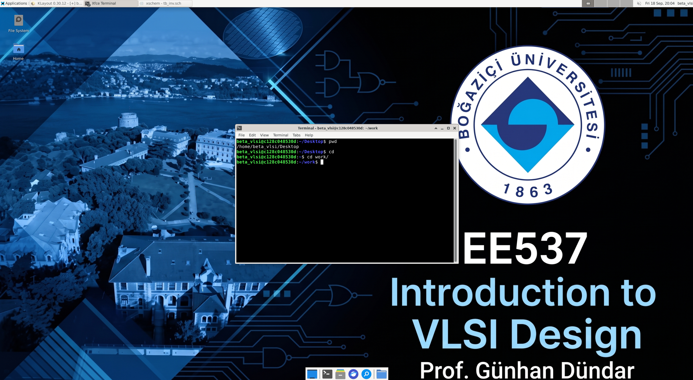

### 2. Place an NMOS
After you typed xschem in terminal it will open gui like the one below.

Add the NMOS device to the schematic.

Add the PMOS version yourself it will be in place with nmos (you can use fuzzy search)
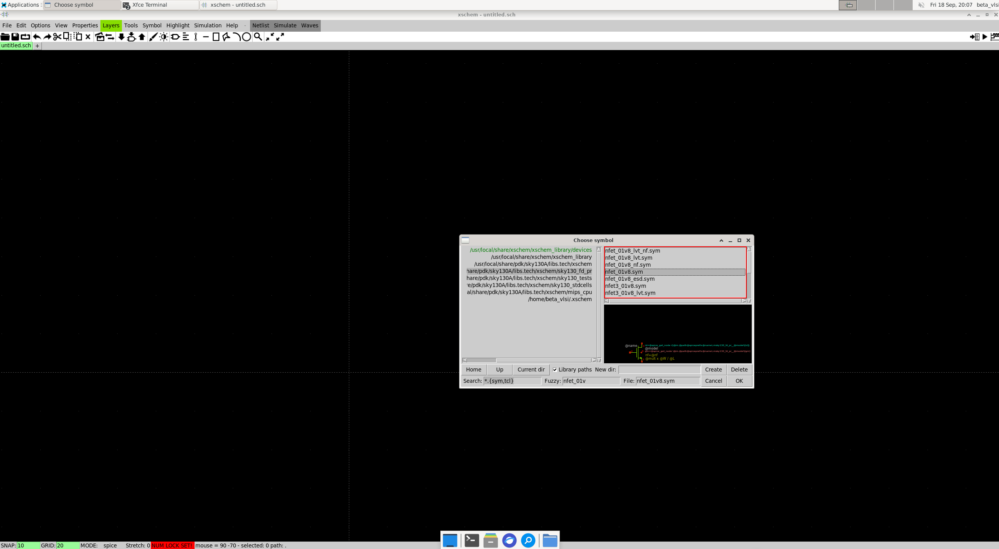

### 3. Add schematic pins
left part of the below window lists some of the available libraries to us.

/usr/local/share/xschem/xschem_library/devices/ lib provide us ideal res cap and dc sources etc. 

other libraries are sky130 related and you will figure out them on the go.

Add the pins needed to connect and test the circuit.

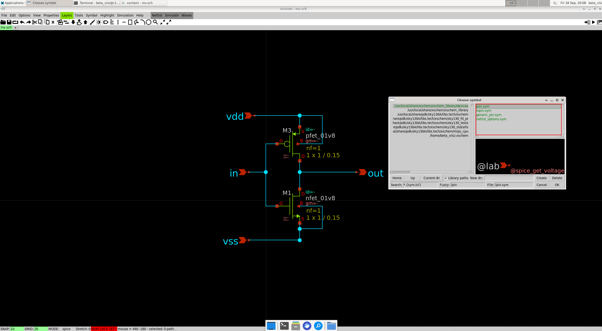

### 4. Rename pin names

Rename the pins so they match the intended circuit signals.

to edit jsut double click on pin or click and press q then edit name in lab=

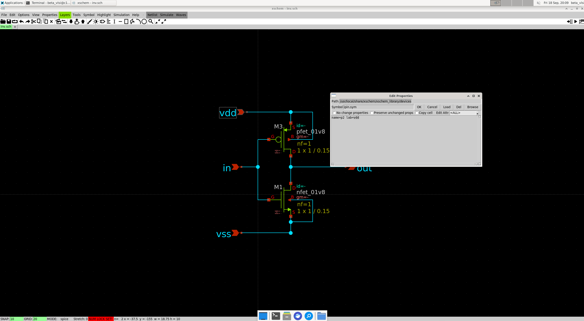

### 5. Make a symbol

Create a reusable symbol from the schematic. by shown toolbar section

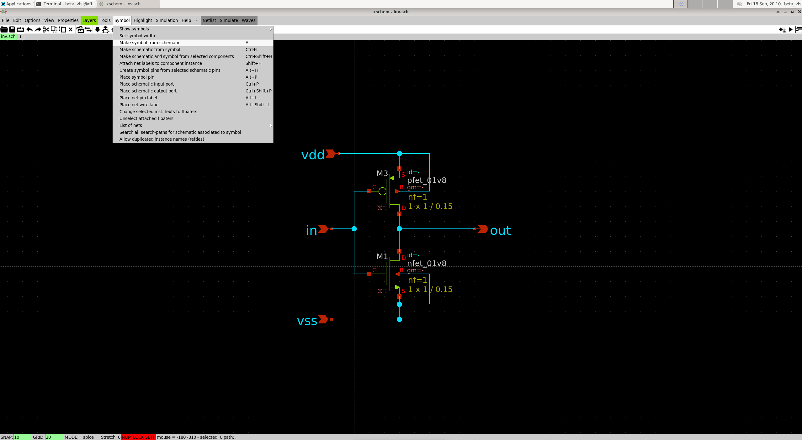

### 6. Open the symbol

Open the generated symbol for use in a testbench.

Your one will be more like square and something you can as you cosmetic pleasure
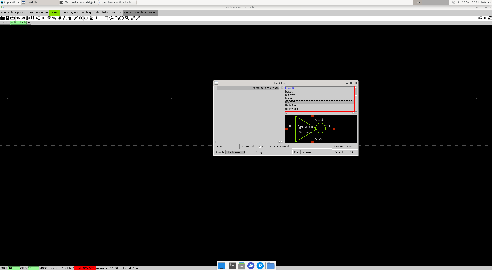

### 7. Create a testbench

click + icon above near sym and sch pages it will give you untitled page.

speaking of which if you wanted to change name your schematic simply click file -> save as and change untitled thing there

Build a testbench around the circuit symbol.

ngspice and xschem cowork together upon scriptiong so you should understand how it works to some extend to write something add code_shown from where you add pins and inside it is like an example below 

name=COMMANDS2
simulator=ngspice
only_toplevel=false
value="
.control
  save all
  tran 10p 10n
  write untitled.raw
.endc
"

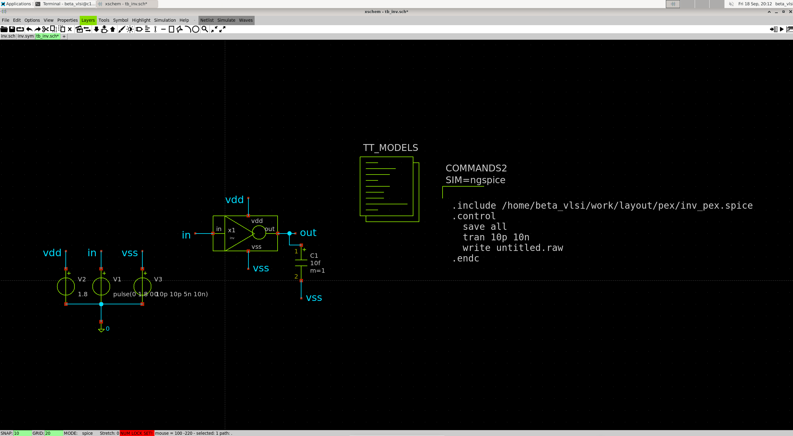

### 8. Find models and examples
probably in above section you can ask where to find the stuff that tt_models and other stuff for that sky130 give us some top level examples which you can reach as below to check what are working examples

inside the top level if you wanted to go inside anything click and press e then if you want to go upper hierarchy again press ctrl+e

Locate the technology models and example files used by the simulation.

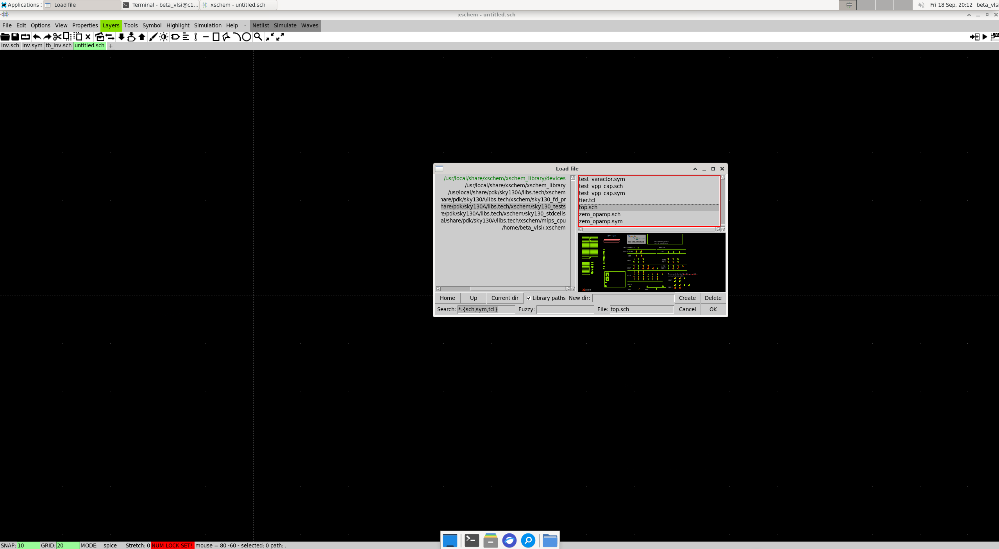

### 9. Run the simulation

Run the simulation and confirm that it completes successfully.

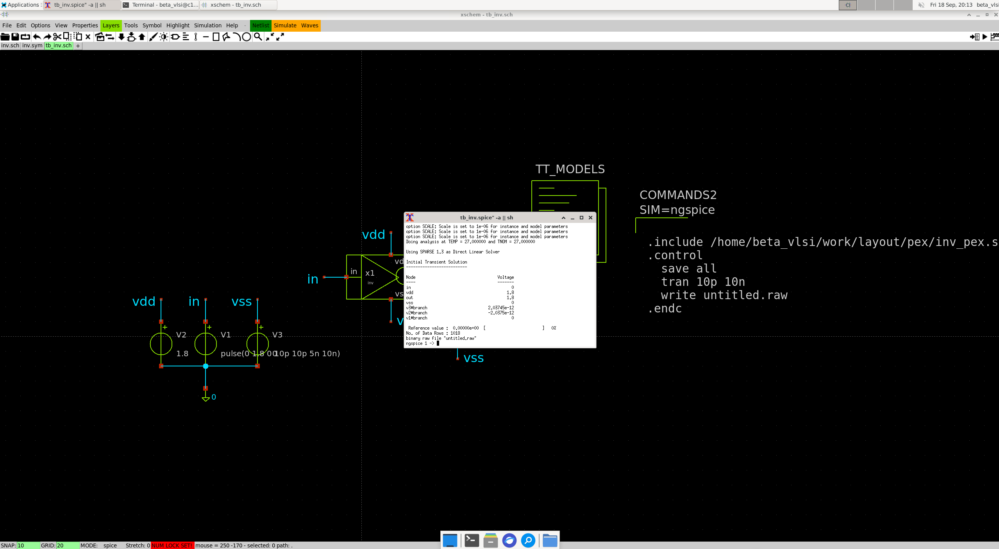

### 10. open external waveform viewer

Open the external waveform viewer to inspect the results.

there are other ways to plot and measure things but for now you can use external viewe 

you can resize it after enable preferences->allow resize

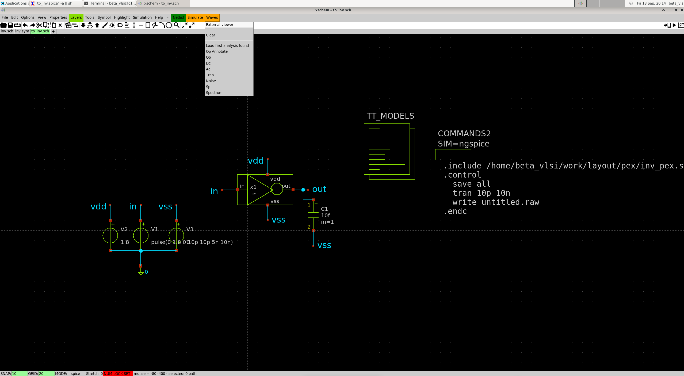

### 11. View the waveforms
after loaded small window will be given to you and you can drag signal e.g V(in) to one of the panes

middle click control second cursor left click control first cursor 

you can resize y scale after clicking one pane go to zoom-> zoom dialog and change y things

you can go between toolbar options to see more ylabels grids etc

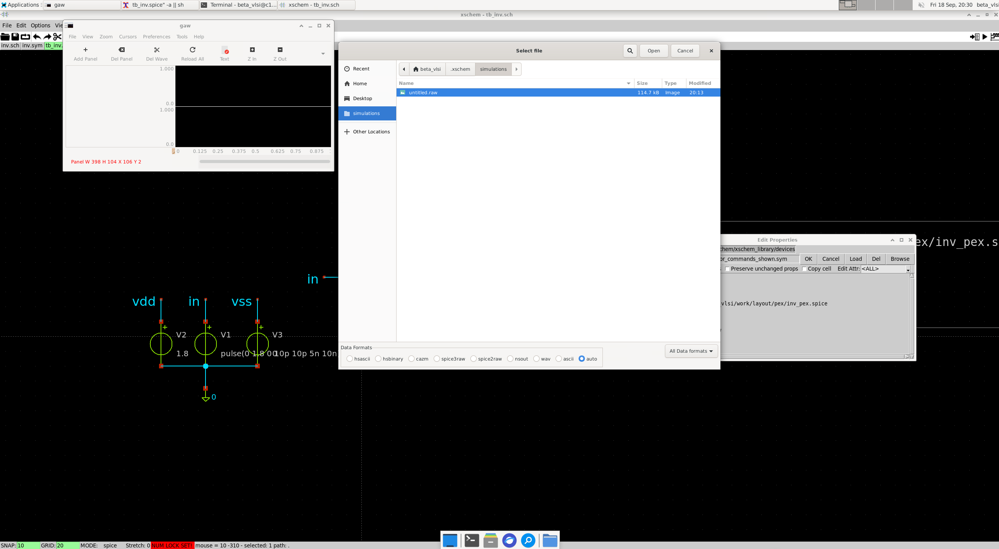

### 12. layout preparation (Klayout based layout will be discussed here for magic you will be directed)
to make things easier we need to change some netlisting options please open your desin schematic not symbol not testbench

then ensure that ones are chosen at you also 

after that click netlist 

to get the netlist into your current directory(otherwise will be deleted as we said)

run in terminal cp ~/.xschem/simulations/yourdesignname.spice .
(your terminal is blocked by xschem simply say file open tab in that terminal and run above cp thing)

using your choice of text-editor you can investigate that .spice file


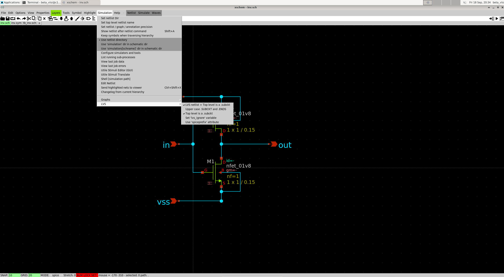


### 13. open klayout
please be sure that technology is selected as below image and you see efabless thing above it 

if everything okay file-> new layout topcell name i recomment you to use same name with your design

after it opens file-> save then write same design_name.gds this time put it with .gds extension

unfortunately import xschem's spice file to here is not working well so we need to add devices manually by ourhand

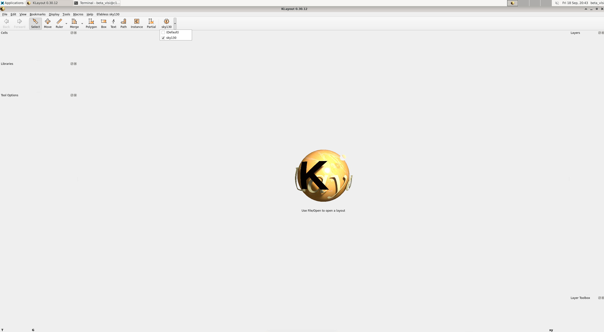

### 14. nfet klayout
click instance from the above toolbar on the left it will show some lib and cell selection 

take library to sky130 pcells

and choose nfet as shown

when you click ok you can place it somewhere in your design

it will be shown like white thing to see layers of it simply press + key to see deeper layers - to opposite

also select nfet and be sure model width length kind of things 

right now lots of the options there will be meaningless but body tie etc also gate contact selection you should give a search about

for now simply choose bulk type to bulktie
and gate contact position to top

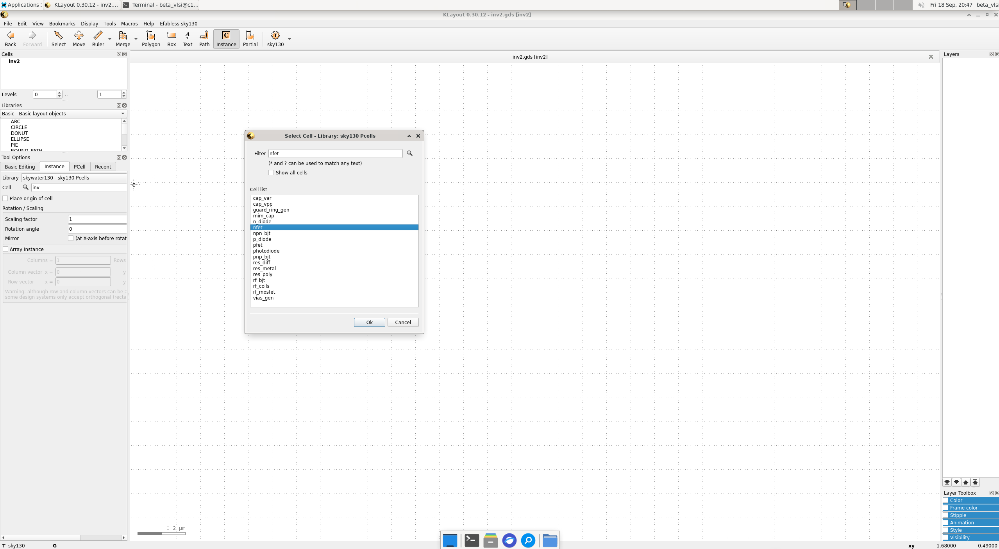

### 15. inverter layout
place pfet thing again be sure width legth other stuff and draw connections

to draw something on right click the layer and press box above such that you can paths etc

explaining everything here will lengthten the situation i will add youtube video to show how to do things 

[add youtube link here ]

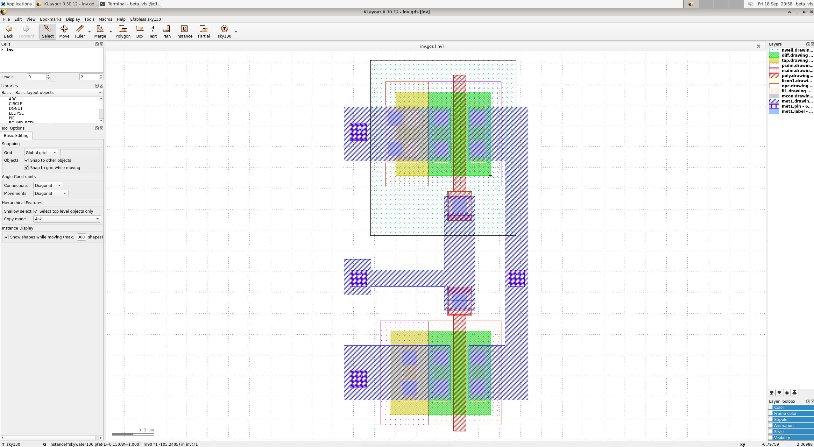

### 16. DRC
to run DRC you can select that toolbar with option if everything goes well you will see something like below 

if now you will see some numbers where when you click that numbers it will explain and highlght the point in layout

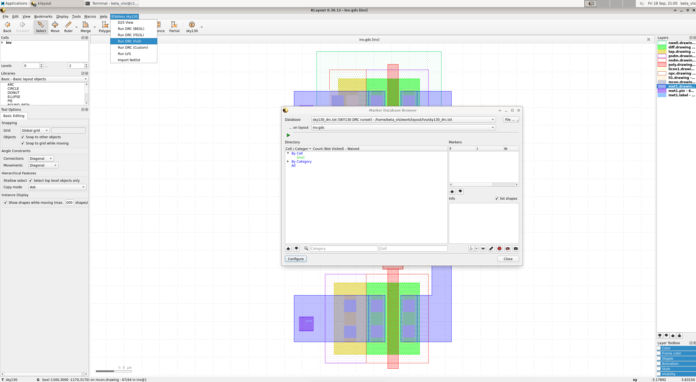


### 17. LVS
to run LVS you need to 
again go to e fabless sky and this time press run lvs

after that you need to select .spice file you generated and kick open
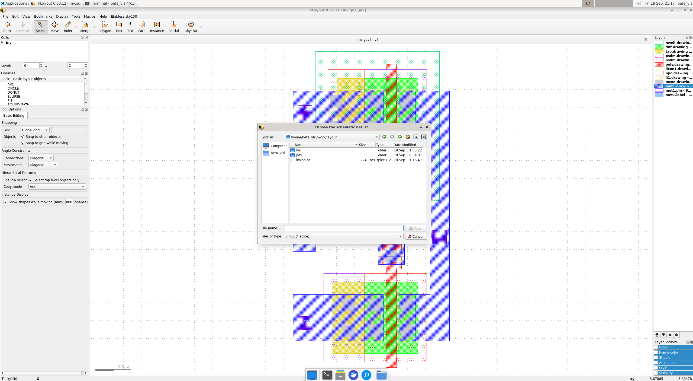

### 18. LVS
some options will be given here you can leave default and check results after run

unfortunately this is not given all lvs checks but interms of coarse level check this is very quick and you can look at and fix some things 

meanwhile some time to  time please go file->save :)
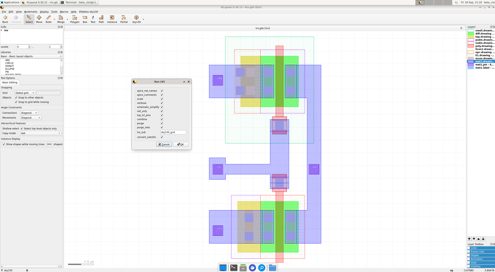

### 19. LVS netgen
as said in above step lvs in klayout is not full check but we can use another tool for quick check for the sake of ease to lvs check and prevent manual pin overwrites and stuff 
we provide simple bash script gds2spice

before running lvs please create another directory inside layout directory as lvs

type "mkdir lvs" to commandline
cd lvs

cp ../your_design.spice .
cp ../your_design.gds .

first step we need to use gds2spice to get .spice file from gds by 
(run inside lvs folder where you just copied stuff)
gds2spice your_design.gds your_design.spice

it should create your_design_magic.spice

you can investigate it at as you wish

to compare this layout generated spice which schematic generated one 

use netgen as follows

netgen -batch lvs "your_design_magic.spice (top level name probably your_design)"\
"your_design.spice (top level name probably your_design)" $PDK_ROOT/$PDK_ROOT/$PDK/libs.tech/netgen/sky130A_setup.tcl

this will give you comp.out and at the end you can see schematic vs layout check matched or not

note: this is actualy loading this klayout thing in magic and try to make ext2spice you can modify the shell script as you wish and remember this is still under development and could have some problems

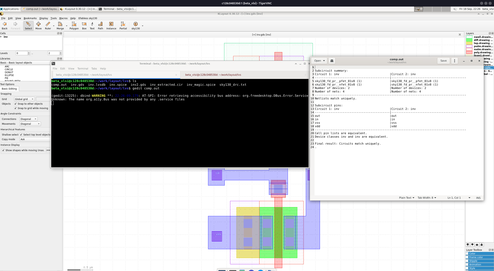


### 20. pex generation
before running pex please create another directory inside layout directory as pex (pex and lvs are both under layout same hierarchy)

type "mkdir pex" to commandline
cd pex 

cp ../your_design.spice .
cp ../your_design.gds .

then run another script we provide to gds2pex

your_design.gds your_design.spice

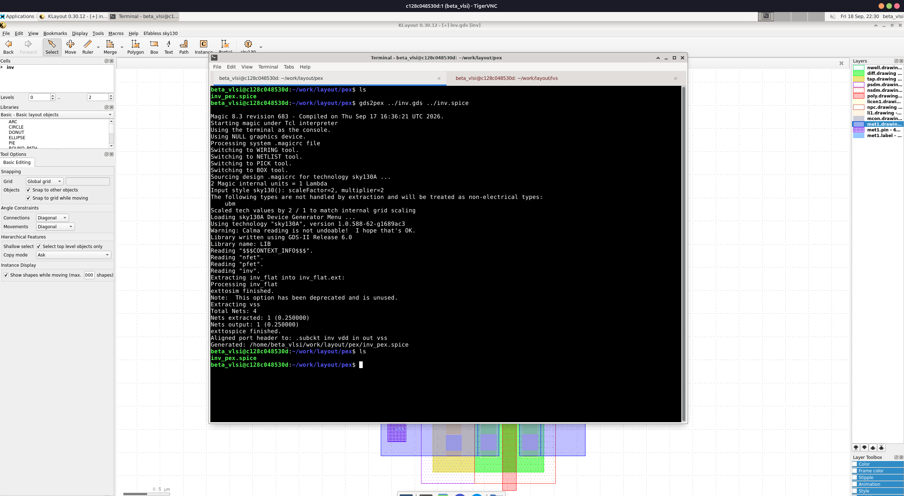


