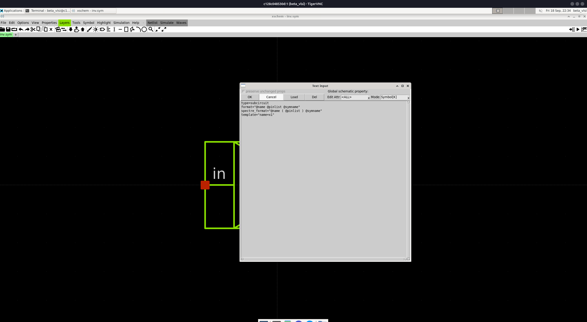
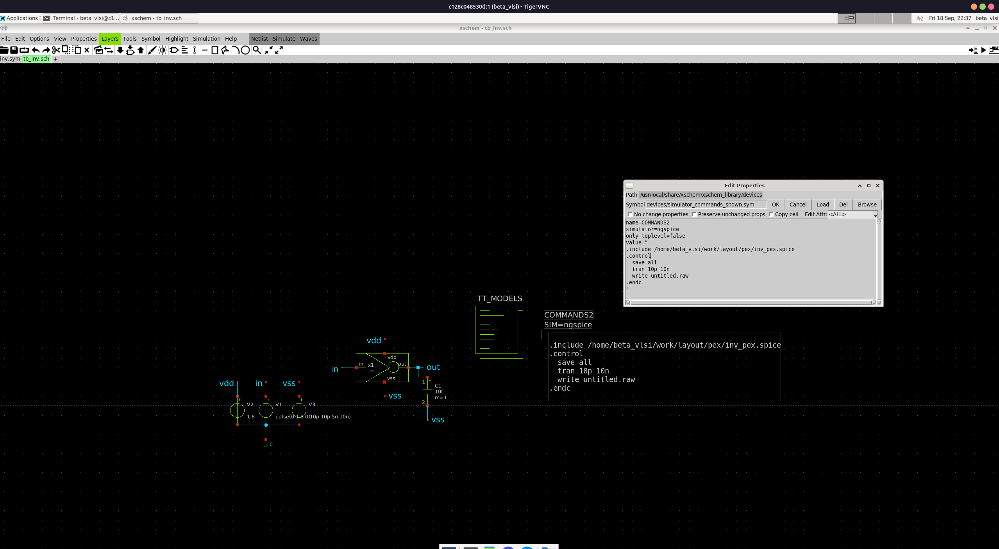
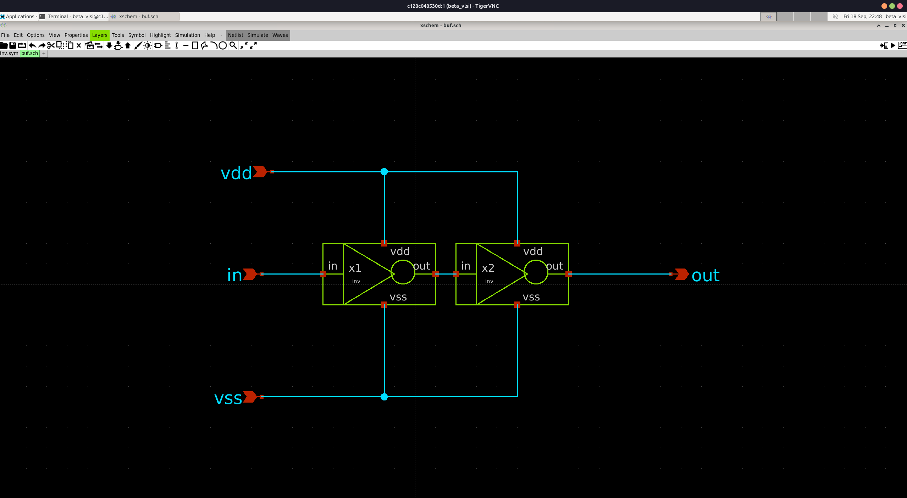
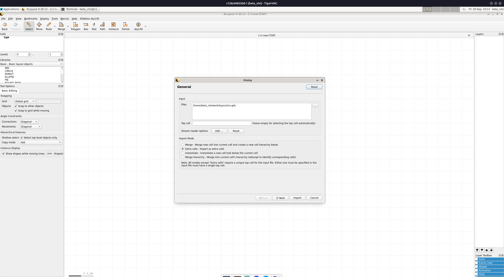
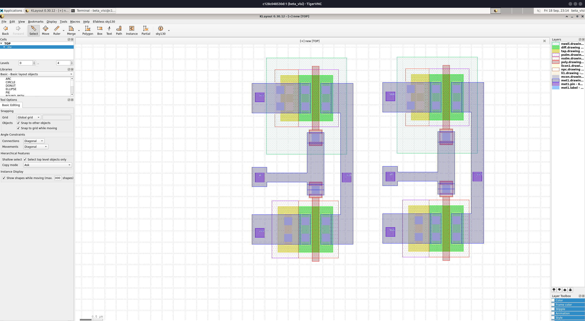

# Sky130 Docker Image

The `src` folder contains the Dockerfile, entrypoint, and wallpaper used to
build the image. Customize those files there if you want to make changes to
the Docker image.

Build the image from the source directory with:

```bash
docker build -t desobey/beta_vlsi:latest src
```

Otherwise, use the published Docker Hub image:

```bash
docker pull desobey/beta_vlsi:latest
docker run -d --rm \
  -p 5901:5901 \
  -p 6080:6080 \
  --shm-size=2g \
  -v "$(pwd)/work:/home/beta_vlsi/work" \
  --name vlsi_test \
  desobey/beta_vlsi:latest
```
> **Important:** To make your changes permanent, replace `$(pwd)/work` in the
> `-v` option with the host directory where you want to store your work.

Open `http://localhost:6080` in a browser to use the desktop through noVNC.
**Recommended:** Use TigerVNC and connect to `localhost:5901`.

## Quickstart

The screenshots below provide a quick path from creating a schematic to
viewing its simulation waveform. More detailed explanations will be added as
the workflow grows.

### 1. Open a Terminal

Start with the terminal commands needed for the project.

`pwd`: shows the current directory (print working directory).

`cd`: changes the directory. If empty, it goes directly to the user's home directory.

`xschem`: run this after you are sure you are in the work directory. This is
where you link your permanent storage; anything not here will be lost after
the Docker container finishes.


### 2. Place an NMOS

After you type `xschem` in the terminal, it will open a GUI like the one below.

Add the NMOS device to the schematic.

Add the PMOS version yourself; it will be next to the NMOS in the library (you
can use fuzzy search).


### 3. Add Schematic Pins

The left part of the window below lists some of the available libraries.

`/usr/local/share/xschem/xschem_library/devices/` provides ideal resistors,
capacitors, and DC sources.

The other libraries are Sky130-related, and you will become familiar with them
as you go.

Add the pins needed to connect and test the circuit.


### 4. Rename Pin Names

Rename the pins so they match the intended circuit signals.

To edit, double-click on a pin or click it and press `q`, then edit the name in the label.


### 5. Make a Symbol

Create a reusable symbol from the schematic using the shown toolbar section.


### 6. Open the Symbol

Open the generated symbol for use in a testbench.

Your symbol will be more like a square and can be customized for appearance.


### 7. Create a Testbench

Click the `+` icon above, near the `sym` and `sch` pages, to get an untitled page.

To change the schematic name, click **File -> Save As** and change the untitled name.

Build a testbench around the circuit symbol.

ngspice and xschem work together through scripting. Add a `code_shown` block
where you add pins. An example is below:

```text
name=COMMANDS2
simulator=ngspice
only_toplevel=false
value="
.control
  save all
  tran 10p 10n
  write untitled.raw
.endc
"
```


### 8. Find Models and Examples

The top level provides `tt_models` and other Sky130 examples that you can use
to check working examples.

Inside the top level, click and press `e` to go inside anything. Press `Ctrl+E`
to go up one hierarchy level.

Locate the technology models and example files used by the simulation.


### 9. Run the Simulation

Run the simulation and confirm that it completes successfully.


### 10. Open the External Waveform Viewer

Open the external waveform viewer to inspect the results.

There are other ways to plot and measure things, but for now you can use the
external viewer.

You can resize it after enabling **Preferences -> Allow Resize**.


### 11. View the Waveforms

After loading, a small window will be given to you. Drag a signal, such as
`V(in)`, to one of the panes.

Middle-click to control the second cursor; left-click to control the first cursor.

You can resize the y scale by clicking one pane, then going to **Zoom -> Zoom
Dialog** and changing the y settings.

You can use the toolbar options to show more y-labels, grids, and so on.


### 12. Layout Preparation

KLayout-based layout is discussed here; for Magic, you will be directed to a
different workflow.

To make things easier, change some netlisting options. Open your design
schematic, not the symbol or testbench.

Then ensure that the required options are selected.

After that, click **Netlist**.

To get the netlist into your current directory (otherwise it will be deleted):

```bash
cp ~/.xschem/simulations/yourdesignname.spice .
```

(Your terminal may be blocked by xschem. Open a new terminal tab and run the
command above.)

You can inspect the `.spice` file using your preferred text editor.


### 13. Open KLayout
Make sure the technology shown in the image is selected and that you can see
the Efabless option above it.

If everything is correct, select **File -> New Layout**. For the top cell name,
we recommend using the same name as your design.

After it opens, select **File -> Save** and save it as `design_name.gds`.

Importing xschem's SPICE file here does not work well, so devices must be added
manually.


### 14. Add an NFET in KLayout
Click **Instance** in the toolbar on the left. This will show the library and
cell selection.

Select the `sky130` pcells library.

Choose `nfet` as shown.

When you click **OK**, you can place it in your design.

It will appear as a white shape. Press `+` to see deeper layers and `-` to go
back.

Select the NFET and review its model, width, length, and other settings.

Many options will not be relevant yet, but you should learn about body ties
and gate-contact selection.

For now, choose `bulktie` for the bulk type and `top` for the gate-contact
position.


### 15. Create the Inverter Layout
Place the PFET, check its width, length, and other settings, and draw the
connections.

To draw something, right-click the layer and select **Box** above. You can then
draw boxes, paths, and other shapes.

Explaining everything here would make this guide too long, so a YouTube video
will be added to show how to do it.

[YouTube link will be added here.]


### 16. Run DRC
Select the DRC option in the toolbar. If everything goes well, you will see
something like the image below.

If there are errors, numbers will appear. Click a number to see its explanation
and highlight the relevant point in the layout.


### 17. Run LVS
To run LVS, go to **Efabless -> Sky130** and select **Run LVS**.

Select the `.spice` file you generated and click **Open**.


### 18. Review LVS Options
You will see several options. You can leave them at their defaults and check
the results after running LVS.

This does not perform every LVS check, but it provides a quick coarse-level
check that can help you find and fix some problems.

Remember to select **File -> Save** from time to time.


### 19. Check LVS with Netgen
As mentioned above, KLayout LVS is not a complete check. We also provide the
`gds2spice` script for a quick LVS check without manually overwriting pins.

Before running LVS, create an `lvs` directory inside the layout directory.

```bash
mkdir lvs
cd lvs

cp ../your_design.spice .
cp ../your_design.gds .
```

First, use `gds2spice` to create a `.spice` file from the GDS file. Run this
inside the `lvs` folder where you copied the files:
```bash
gds2spice your_design.gds your_design.spice
```

This should create `your_design_magic.spice`.

You can inspect it as needed.

To compare the layout-generated SPICE with the schematic-generated SPICE,
use Netgen as follows:

```bash
netgen -batch lvs "your_design_magic.spice (top level name probably your_design)"\
"your_design.spice (top level name probably your_design)" $PDK_ROOT/$PDK_ROOT/$PDK/libs.tech/netgen/sky130A_setup.tcl
```

This creates `comp.out`. At the end, you can see whether the schematic and
layout checks matched.

Note: This loads the KLayout design in Magic and attempts to create an
`ext2spice` file. You can modify the shell script as needed. This workflow is
still under development and may have problems.


### 20. Generate PEX
Before running PEX, create a `pex` directory inside the layout directory. PEX
and LVS should be at the same level under the layout directory.

```bash
mkdir pex
cd pex

cp ../your_design.spice .
cp ../your_design.gds .
```

Then run the `gds2pex` script we provide:

```bash
gds2pex your_design.gds your_design.spice
```


### 21. Run PEX Simulation on the Symbol
Now that we have a SPICE file with parasitics, we need to make some changes
before simulating the symbol. Open the inverter symbol in xschem, left-click
an empty area, and press `q`.

As shown in the image below, change `type:subcircuit` to `type:primitive`.




### 22. Run PEX Simulation on the Testbench
In the testbench, add the SPICE definition that the symbol expects. Add the
`.include` line.

Remember to edit the path and filename to match your files.

After that, you can check the netlist again.

Note: Press `Shift+A` and click **Netlist** to show the netlist in place.

Note: There are other ways to import PEX SPICE into the testbench; you can
search for and use them.

After this, you can use the waveform viewer again. For a simple inverter, the
results should not differ much from the schematic simulation.

Critical Note: after you are done with pex sim go symbol left click empty place then press q and revert the change we made to type:primitive   



## Hierarchical Design

This section introduces a design made from reusable schematic blocks. It is not managable to handle large design in single sheet and you need to get used to make reusable symbols

### 1. Start a New Hierarchical Design

Begin with a new top-level schematic. Create another file which will be top level and put your inv.sym as below 2 of them make 1 buffer. 

create symbol of it and create testbench which instantiete new thing symbol buf

You can copy paste bunch of things from inv example.

after succesfull sym if you are ready to go for layout again go to design schematic (not tb not sym)

again choose correct simulation->lvs options and click netlist 

copy the spice this time it will be like 

cp ~/.xschem/simulations/buf.spice .



### 2. Start a New Hierarchical Layout

again open layout new layout then name it with you design name (mine was buf)

after that go to file->import->other files into current then using ... find your inv.gds and click import

after that you can again at top click instance under local library (click magnifier and there should be inv)

place 2 of them 


### 3. shallow select
under your hierarchy (mine was TOP by mistaken it should be buf)
click inv 

and tick the shallow select box below otherwise you will edit this instantiated inv in place 

wire them up put pin and label 

first run drc (design rule check)

then lvs 

after that netgen lvs

pex and sim (you need to change buf.sym to primitive and add .include to tb)
